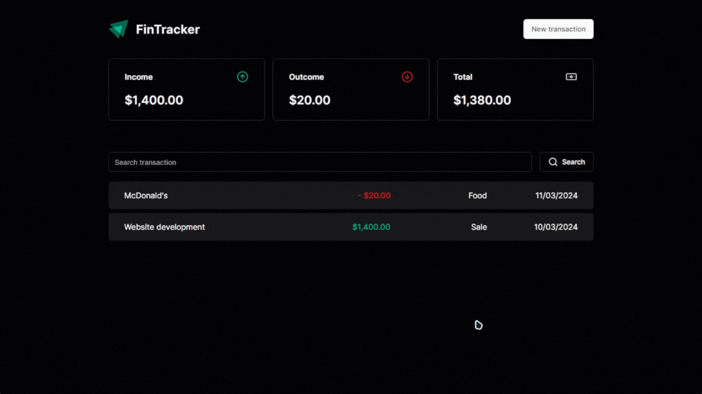

    <h2>⚜️ F I N &nbsp; T R A C K E R ⚜️</h2>

    <a href="#-project">Project</a>&nbsp;&nbsp;&nbsp;|&nbsp;&nbsp;&nbsp;
    <a href="#-technologies">Technologies</a>&nbsp;&nbsp;&nbsp;|&nbsp;&nbsp;&nbsp;
    <a href="#-features">Features</a>

 

    
      <h3 align="center">
        <strong>
            <a href="https://react-finance-tracker-xi.vercel.app">live demo</a>
        </strong>
    </h3>

 

## 📚 Project

Experience seamless finance management with FinTracker.

With a clean and intuitive interface, Fin.Tracker allows you to effortlessly manage your income and outcome, providing insightful analyses to help you stay on top of your finances.

 

## 🖥 Technologies

- [React](https://react.dev/)
- [TypeScript](https://www.typescriptlang.org/)
- [Tailwindcss](https://tailwindcss.com/)
- [JSON-Server](https://github.com/typicode/json-server/tree/v0)

 

## 🧾 Features

- [x] Retrieve transactions stored in the database (via json-server)
- [x] Create a new transaction
- [x] Search for an existing transaction
